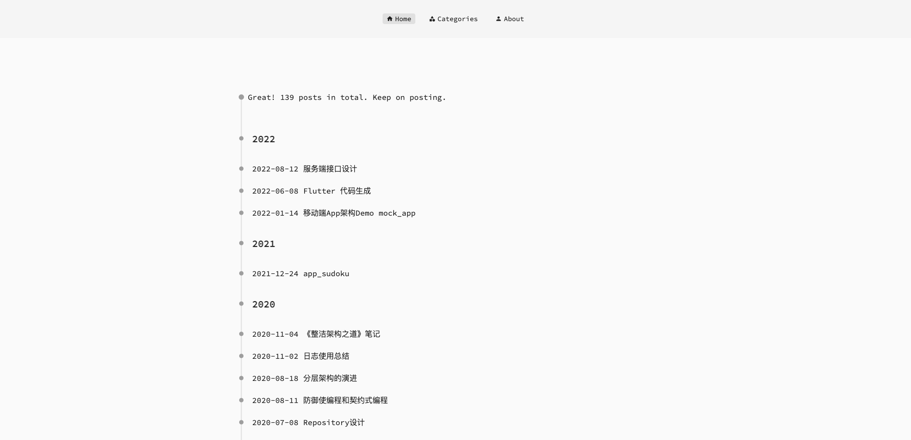
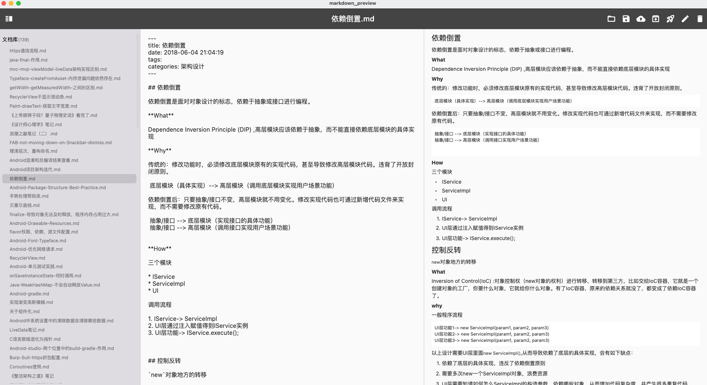

Flutter web实现的基于Markdown的Blog




优点：
1. 使用markdown写blog,兼容hexo
2. 编辑器可以直接复制图片，图片会打包在web项目中，所有blog数据都集中在一起。不用去三方找图床，也避免以后图片资源不见了，显示不了图片到问题
3. 利用Github Actions和Github pages实现自动编译部署

缺点：
1. Flutter Web启动太太太太慢了
2. Flutter Web Markdown的渲染不好看，选中复制字符等操作很不流畅。

写这个东西的初衷是因为用hexo的时候写带图片的文章太麻烦了，而且随着hexo的升级，总有可能编译不过。

## 使用
1. 创建markdown文章 
2. 运行脚本工具，将markdown文件转换为json文件，存放在assets目录中
3. flutter web项目从json文件中读取数据，并显示
4. 上传到github，利用Github action自动编译发布网站到git page上显示

### Markdown文章转换为json接口文件
使用markdown_editor，项目地址：https://github.com/yeshu-cn/blog_markdown_editor
1. 创建，编辑，预览markdown文件
2. 生成json接口文件
3. 启动项目本地预览blog

### GitHub Actions自动构建并部署Flutter Web到Github Pages
1. 创建Flutter Web项目并上传到Github仓库中
2. 创建`access token`
3. 利用`access token`再仓库中创建`commit secret`
4. 配置Github Actions
```yaml
name: Flutter Blog
on:
  push:
    branches:
      - master
jobs:
  build:
    name: Build Web
    env:
      my_secret: ${{secrets.commit_secret}}
    runs-on: ubuntu-latest
    steps:
      - uses: actions/checkout@v3
      - uses: subosito/flutter-action@v2
        with:
          flutter-version: '3.3.2'
          channel: 'stable'
      - run: flutter --version
      - run: flutter config --enable-web
      - run: flutter pub get
      - run: flutter build web --release --base-href="/flutter_blog/" --web-renderer html
      - run: |
          cd build/web
          git init
          # 改成你的提交邮箱
          git config --global user.email guan.yeshu@gmail.com
          # 改成你的提交用户名
          git config --global user.name yeshu
          git status
          # 更改此远程URL，例如查看您的远程URL是 https://github.com/onatcipli/flutter_web.git 然后改成以下内容
          git remote add origin https://${{secrets.commit_secret}}@github.com/yeshu-cn/flutter_blog.git
          git checkout -b gh-pages
          git add --all
          git commit -m "update"
          git push origin gh-pages -f
```

* [使用Flutter Web和GitHub Actions构建发布自己的Github Pages网站](https://www.it610.com/article/1495533844500119552.htm)

* [404 Failed to load resource Deploying Flutter Web App to GitHub Pages
  ](https://stackoverflow.com/questions/65689346/404-failed-to-load-resource-deploying-flutter-web-app-to-github-pages)

## 其他
渲染的中文标点正常
$ flutter run -d chrome --web-renderer canvaskit

渲染的中文标点会居中，不正常
$ flutter run -d chrome --web-renderer html

参考：https://docs.flutter.dev/development/platform-integration/web/renderers


