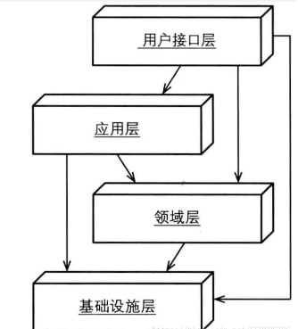
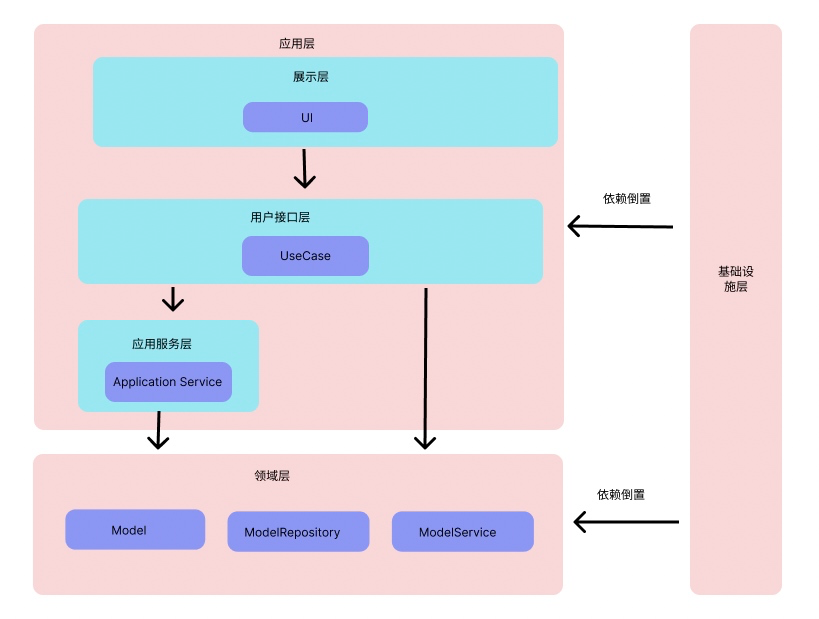

# 架构设计及移动端项目中的实践
## 基础概念
### 什么是抽象/业务，什么是具体实现？
首先必须能区分清楚抽象和具体实现的概念，后面的架构思想都是在抽象这个维度进行设计。
* 抽象很多时候可以直接理解为业务结果
* 具体实现是技术细节、流程

```java
// 函数名就是抽象
UserInfo getUserInfo(String uid){
    // 代码是具体实现，它可能是：
    // 1. 从内存获取用户信息
    // 2. 从服务端API获取用户信息
    // 3. 从本地数据库获取用户信息    
}


bool isShowQQLogin() {
    // 1. 程序版本号大于1.0则显示QQ登录
    // return versionCode > 1.0;
    
    // 2. 用户是vip则显示QQ登录
    // return user.isVip;
    
    // 3. 用户性别是男性则显示QQ登录
    // return user.isMale;
}
```

### 什么是关注点分离，哪些地方可以实现关注点分离?

> 注点分离是日常生活和生产中广泛使用的解决复杂问题的一种系统思维方法。大体思路是,先将复杂问题做合理的分解,再分别仔细研究问题的不同侧面(关注点)，最后综合各方面的结果，合成整体的解决方案。

程序设计中用到关注点分离思想的地方 
* 抽象和具体实现的分离，关注抽象，类似日常中所说的结果导向，只关注结果，不关注过程。
* 数据层，业务层，展示层的职责分离

例如展示层的登录页面，页面只关注业务结果，不关注业务实现过程，业务实现过程应当属于业务层，即使它只有一行代码。

```java
// good 
if (isShowQQLogin()) {
    showQQLoginUI();
}

// bad
if (versionCode > 1.0) {
    showQQLoginUI();
}

// bad
if (user.isVip) {
    showQQLoginUI();
}
```

## 架构是为了解决什么问题,如何解决的？

项目代码追求的两个目标：
1. 程序功能稳定性（高性能运行，不崩溃）
2. 代码的易维护性（代码易读，易扩展）

其中**稳定性**的取决于各种**具体实现**,**易维护性**则需要通过架构来实现。

### 架构的战略
1. 管理复杂度，让代码易读
2. 支持扩展和复用

### 架构的战术
管理复杂度的术(指导思想就是分离关注点)：
1. 内聚性高的代码放在一起，然后在管理好内聚代码之间的依赖关系
3. 定义好角色的职责，什么代码应该在什么角色的类文件中
4. 定义好层次，将各个角色放在不同的层次位置中，管理好它们之间的依赖关系

支持复用和扩展的术：
1. 理清需求中的抽象接口和具体实现, 编程依赖抽象的接口
2. 业务接口，抽象接口的命名和参数不能和具体实现耦合，不要暴露技术实现细节。

> 有多少次，我看到的系统设计图里，根本没有“层次”的概念，各个模块没有一致的层次划分，与子系统交互的不是子系统，而是一盘散沙式的接口，甚至接口之间随意互调、关系乱成一团麻的情况也时常出现，带来的就是维护和调试的噩梦。

所有的架构都是为了解决这些问题，区别只是它们定义的角色职责，层次结构，和依赖关系不同。

> Architecture is about the intent the shape of the system, the way its components are organized, and the dependencies between those components, is about the intent of the system, not about what it's built around.
 
我自己项目的架构设计一般会参考领域驱动设计中的角色定义，层次结构使用经典的三层结构，依赖关系使用单向依赖。

## 领域驱动设计介绍

### 角色及其职责
* 实体和值对象
```
// 包含唯一表示id的是实体
class User {
    int id;
    String name;
    int age;
    Address addr;

    // 贫血模型，包含少量的业务代码
    fun ski() {
    
    }
}

// 不需要任何的身份标识，仅仅表示值，它的值应该是不可变的
class Address {
    final String province;
    final String city;
}
```

* 聚合：一个高内聚的业务集合，一般由一个实体+多个值对象组成。
* 聚合根：聚合的业务对外的唯一接口，组成聚合的那个实体就是聚合根。
* 聚合仓库：负责对聚合的增删改查，它的参数只会是一个完整的聚合根。
* 领域服务：负责实现多个聚合之间的业务操作
* UseCase: 业务层针对用户界面的接口，调用领域层接口，拼装数据返回给用户
* 应用服务：沉淀UseCase中的通用业务逻辑作为应用层的服务

> application-specific, they're not independent of application。

发现应用服务的案例
```java
// domain层认证服务
class AuthService {
    AuthInfo auth(String username, String pwd);
}
// domain层用户服务
class UserService {
    UserInfo getUserInfo(String id)
}

// UseCase
class AndroidLoginUseCase {
    LoginDto login(String username, String pwd) {
        // authService认证
        // userService 获取用户信息
        // 拼装LoginDto并返回
    }
}

// UseCase
class DesktopLoginUseCase {
    LoginDto login(String username, String pwd) {
        // authService认证
        // userService 获取用户信息
        // 拼装LoginDto并返回
    }
}
```
这时候发现AndroidLoginUseCase和DesktopLoginUseCase中的代码是一样的，我们就把这段代码下沉到应用服务层去
```java
class LoginService {
    LoginDto login(String username, String pwd) {
        // authService认证
        // userService 获取用户信息
        // 拼装LoginDto并返回
    }
}

// UseCase
class AndroidLoginUseCase {
    LoginDto login(String username, String pwd) {
        // loginService进行登录
    }
}

// UseCase
class DesktopLoginUseCase {
    LoginDto login(String username, String pwd) {
        // loginService进行登录
    }
}
```
客户端登录的时候不能直接调用LoginService,因为万一Android哪天需要返回的登录数据不同的话，只需要修改AndroidLoginUseCase的实现即可，不需要修改LoginService，LoginService是架构相对底层的代码，修改它会影响其他对它有依赖的功能模块。


### 层次设计
经典的DDD架构图




使用依赖倒置优化过后的架构



### 移动端项目整体架构设计


基于上述架构的移动端客户端架构设计


## 以服务端为主的架构设计
客户端只是作为架构中的展示层
### 现状
但实际上大多数服务端是没有区分应用层的，从而导致需要客户端来实现应用层的接口，提供给UI


这种方式的缺点：
1. 应用层的业务逻辑实现移动到了客户端（失去了安全性，业务变动的灵活性）
2. 需要多次进行远程的网络请求，业务逻辑的实现相比服务端还添加了网络的因素，让业务实现起来更加复杂。
3. 多次网络请求的耗时，耗电让用户体验更不好
4. android,ios,web,destop必须重新各自实现一遍业务逻辑，一方面浪费资源，再一方面很难保证所有平台业务实现的正确性和一致性。

### 妥协的方案
最根本的方法，就是服务端区分应用层和业务层的实现，提供应用层的API。
但由于各种问题，服务端没有做这个应用层，然后展示层就催生出了bff, GraphQL这样的技术产物。


## 以客户端为主的架构设计
服务端只是作为业务层的具体实现的一种方式


## Google官方架构指导
以前Google只有MVC,MVP, MVVM架构，但这些方案都只是在处理数据和UI之间的关系，没有区分出数据和业务之间的关系。前两年官方才出了下图的架构，在业务复杂的场景下加入了业务层/领域层。实际上就是传统的三层架构。


* 简单的程序，直接UI调用数据层
* 复杂的程序，添加业务层


* 简化去掉了Service这样的角色，将Service的职责添加到了UseCase中。
* 服务端Api只是作为UseCase的具体实现的一个手段。
* UseCase不是针对页面的，是相对可以复用的业务层接口

我为什么要添加Service和修改UseCase的职责呢?
* 当版本迭代，程序重构的时候，不能有效的区分哪些UseCase可用，哪些不可用,也不敢乱删代码。
* Repository中类似调用API获取并缓存数据的逻辑实现和当前版本需求密切相关，版本迭代时不能保证这段代码是否可用，UI层的逻辑不应该牵连到Repository中。
* 将UseCase作为针对每个页面的接口，只需要当前页面需求不变，这个UseCase就表示可以复用，如果当前页面发生变化，则可以直接删除这个文件。遵循了开闭原则。

## 总结
1. 核心业务在服务端的程序，推荐采用服务端为主的架构。
2. 核心业务在客户端的程序，例如工具类app，推荐使用客户端为主的架构。
4. 代码可以没必要完全按照架构图来，但概念要分清楚。

## 资料：
* https://github.com/android/nowinandroid/blob/main/docs/ArchitectureLearningJourney.md
* https://developer.android.com/topic/architecture#best-practices

